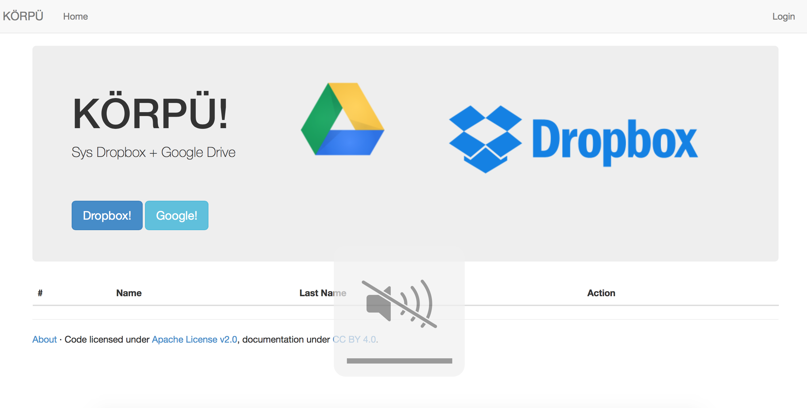
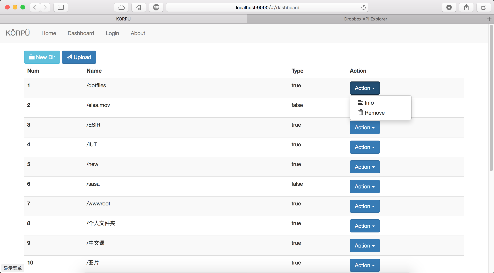
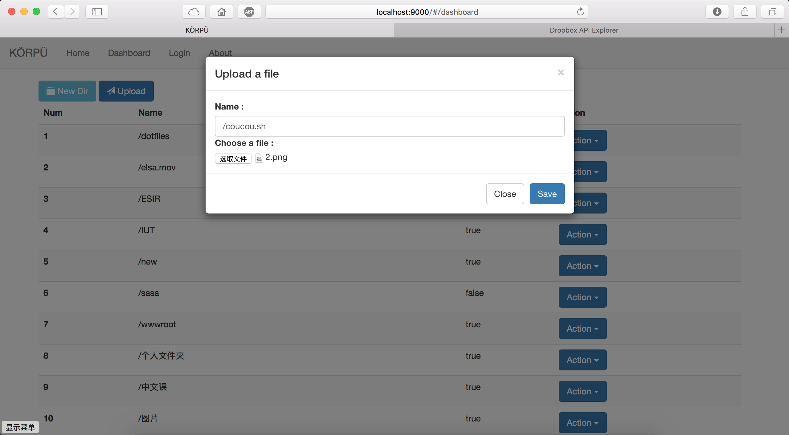

# KÖRPÜ

## Intro

Dropbox + Google 


## Dir

- Web
- korpu-rest
- Readme.md


## KÖRPÜ-REST

`korpu-rest.war` => jetty or tomcat or `docker`

`conf` => dropbox.xml

Example => URL: http://localhost:8080/api/v1/{metode}

## List des méthodes

* Format normal

```json
// success
{
	"dropbox":[],
	"google":[]
}
// cas error
{
	"error":msg
}
```

* callbackDropbox
    
```json
{
	"access_token":"xxx",
	"uid":"xxx",
	"token_type":"bearer"
}

```
 
* callbackGoogle

```json
{
	"access_token":"xxx",
	"uid":"xxx",
	"token_type":"bearer"
}
```

* ls

```json
{
  "dropbox": {
    "thumb_exists": false,
    "path": "\/",
    "size": "0 bytes",
    "contents": [
      {
        "thumb_exists": false,
        "path": "\/dotfiles",
        "rev": "5b3a041b6cba",
        "size": "0 bytes",
        "read_only": false,
        "is_dir": true,
        "bytes": 0,
        "modifier": null,
        "root": "dropbox",
        "icon": "folder",
        "modified": "Sun, 13 Mar 2016 18:28:45 +0000",
        "revision": 23354
      },...}
    "google":{
    	regarde sur google
    	}

```

*   info

```json
{
	"dropbox":{...},
	"google":{...}
}
```

*   detailFile(String file);

```json
{
	"dropbox":{...},
	"google":{...}
}

```

*   rm(String file) =>api/v1/rm?name=xxx

```
{
	"dropbox":{...},
	"google":{...}
}
```

pas envie de tous détailler, reagrde `Api.java`

* mv(String from,String to)
* mkdir(String dir)
* share(String name)
* login(user,passwd)
* upload()

## Web

Angular js 







## Licence

Apache 2


