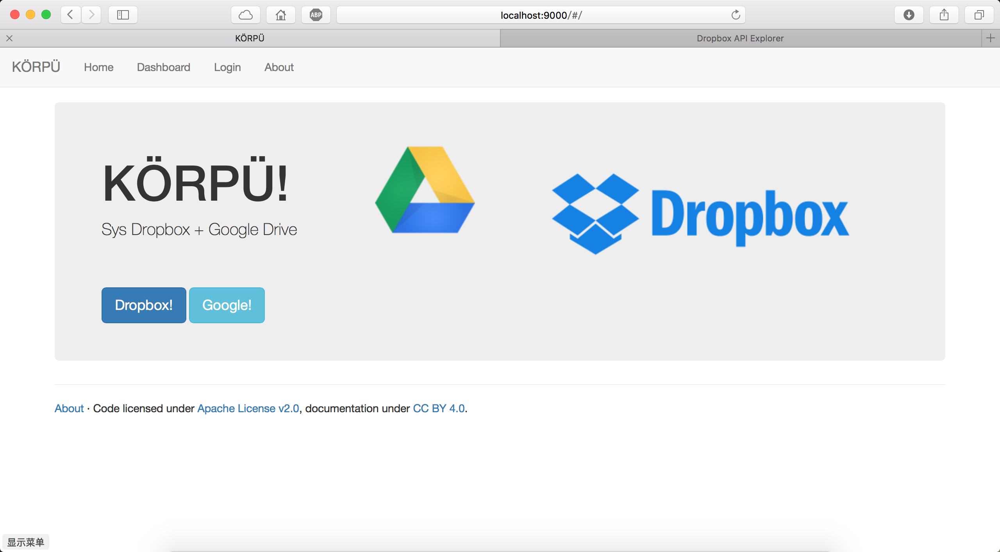

# KÖRPÜ

## Intro

Dropbox + Google 


	JXS+JXW
	mvn archetype:generate -DarchetypeArtifactId=jersey-quickstart-webapp -DarchetypeGroupId=org.glassfish.jersey.archetypes -DinteractiveMode=false -DgroupId=me.qfdk -DartifactId=korpu-rest -Dpackage=me.qfdk.rest -DarchetypeVersion=2.16


tech: JAVA

## Dir

- Web
- korpu-rest
- Readme.md


## KÖRPÜ-REST

Lancer le serveur, il faut avoir le fichier config

URL: http://localhost:8080/api/v1

le retour en format json.

```json
// success
{
	"dropbox":[],
	"google":[]
}

// cas error
{
	"error":msg
}
```

## Web

Angular js 




## Licence

Apache 2


